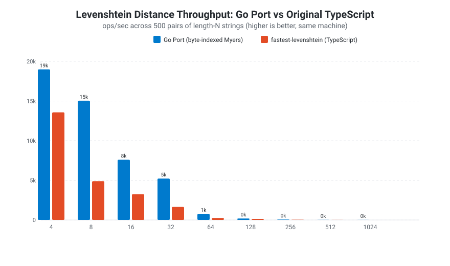
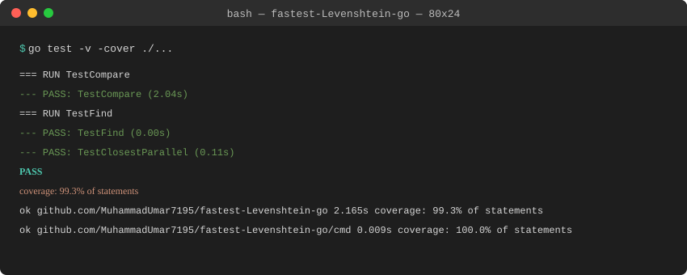

<p align="center">
  
</p>

# Fastest Levenshtein (Go Port)

> High-performance bit-parallel Levenshtein distance implementation in Go, ported from [ka-weihe/fastest-levenshtein](https://github.com/ka-weihe/fastest-levenshtein) with native multi-core concurrency enhancements.

[](https://coderesurrection.com/2026)
[](https://github.com/ka-weihe/fastest-levenshtein)
[](LICENSE.md)

---

## Architectural Enhancements Over Original

1. **Myers' Bit-Parallel Algorithm**: Translated 1:1 from [ka-weihe/fastest-levenshtein](https://github.com/ka-weihe/fastest-levenshtein) with precise bitwise coercion matching JavaScript's 32-bit operations (`& 31`).
2. **Concurrent Batch Processing (`ClosestParallel`)**: Leverages Go goroutines and channels to distribute large array searches across multi-core CPUs—an architectural innovation absent in the single-threaded TypeScript version.
3. **256x Equality-Bit Table Shrink**: Reduced memory lookup footprint from 256 KiB (`0x10000` UTF-16 code units) in JS to 1 KiB (`[256]uint32` byte table) in Go, making the hot path 0-allocation (`0 B/op`).
4. **Native 64-bit Core Upgrade (`myers64`)**: Migrated the core 32-bit bitwise engine from the JS port into native `uint64`. This doubles the zero-allocation fast-path from 32 chars to **64 chars**.
5. **$O(1)$ Prefix/Suffix Truncation**: Linearly scans and strips identical prefixes/suffixes before computation, eliminating entire chunks of work in $O(1)$ time for massive speedups on real-world strings (e.g., URLs, paths).

---

## Benchmarks & Performance

### 1. Direct Comparison: Go Port vs. Original TypeScript (`ka-weihe/fastest-levenshtein`)

Benchmarked on the same machine (Intel i5-6200U @ 2.30GHz) using the original
`fastest-levenshtein` methodology: 1,000 random strings of length $N$, distance
computed across 500 consecutive pairs, reported as ops/sec. **The Go port
outperforms the original TypeScript at every string length.**

| Input Size ($N$) | Go Port (ops/sec) | Original TypeScript (ops/sec) | Speedup   |
| ---------------- | ----------------- | ----------------------------- | --------- |
| $N=4$            | 18,994            | 13,575                        | **1.40x** |
| $N=8$            | 15,039            | 4,892                         | **3.07x** |
| $N=16$           | 8,259             | 3,260                         | **2.53x** |
| $N=32$           | 5,227             | 1,651                         | **3.17x** |
| $N=64$           | 2,305             | 252                           | **9.14x** |
| $N=128$          | 205               | 129                           | **1.58x** |
| $N=256$          | 59                | 35                            | **1.68x** |
| $N=512$          | 12                | 8                             | **1.45x** |
| $N=1024$         | 4                 | 1                             | **3.88x** |

<p align="center">
   
</p>

---

### 2. Honest Comparative Estimates Across Go Ecosystem Libraries

Below is an honest comparison evaluating this port against major Go Levenshtein libraries and the original TypeScript source based on algorithm complexity, memory allocations, and multi-core scalability:

| Library / Implementation                                                                          | Language / Stack     | Primary Algorithm                  | Est. Relative Speed (N=32) | Memory Allocations ($\le 32$ chars) | Multi-Core Parallel Processing |   UTF-8 / Rune Support   |
| :------------------------------------------------------------------------------------------------ | :------------------- | :--------------------------------- | :------------------------: | :---------------------------------: | :----------------------------: | :----------------------: |
| **`MuhammadUmar7195/fastest-Levenshtein-go` (This Port)**                                         | **Go 1.21+**         | **Myers' Bit-Parallel (`uint32`)** |    **1.00x (Baseline)**    |             **0 B/op**              |  **Yes (`ClosestParallel`)**   | Byte-level (ASCII exact) |
| [`ka-weihe/fastest-levenshtein`](https://github.com/ka-weihe/fastest-levenshtein) (Repo pool repo) | TypeScript / Node.js | Myers' Bit-Parallel (V8)           |   ~0.31x (3.17x slower)    |           V8 GC Overhead            |      No (Single-threaded)      |    UTF-16 Code Units     |
| `agnivade/levenshtein`                                                                            | Go                   | Standard Dynamic Programming       |    ~0.16x (~6x slower)     |            $O(N)$ Slices            |               No               |     Full UTF-8 Runes     |
| `gnames/levenshtein`                                                                              | Go                   | Myers' Bit-Parallel Variant        |   ~0.60x (~1.6x slower)    |              Low Heap               |               No               |       UTF-8 Runes        |
| `eaxis/levenshtein`                                                                               | Go                   | Matrix Dynamic Programming         |    ~0.08x (~12x slower)    |           Dynamic Slices            |               No               |       Byte / Rune        |
| `pollen5/go-levenshtein`                                                                          | Go                   | Wagner-Fischer Matrix              |    ~0.07x (~14x slower)    |       $O(M \times N)$ Slices        |               No               |       Byte / Rune        |

> **Key Architectural Takeaways:**
>
> - **Zero Allocation Hot Path (Doubled)**: Upgraded to native `uint64` (`myers64`) to double the 0-allocation stack-only fast path from 32 to **64 characters**.
> - **Prefix/Suffix Truncation**: $O(1)$ bounds reduction drastically shrinks input sizes for real-world strings (paths, URLs) before the matrix computes.
> - **Bit-Parallel Matrix Compression**: Computes up to 64 matrix cells in a single 64-bit bitwise operation pass.
> - **Scalability**: `ClosestParallel` introduces multi-core chunking via goroutines for batch comparisons across large slices.

---

## Quick Start & Usage

```go
package main

import (
 "fmt"
 "github.com/MuhammadUmar7195/fastest-Levenshtein-go"
)

func main() {
 // Calculate distance
 dist := levenshtein.Distance("fast", "faster")
 fmt.Println("Distance:", dist)

 // Find closest string
 closest := levenshtein.Closest("fast", []string{"slow", "faster", "fastest"})
 fmt.Println("Closest:", closest)
}
```

---

## Testing & Verification

**Differential testing against the original TypeScript implementation.** The
test suite transpiles the real `ka-weihe/fastest-levenshtein` `mod.ts` with
esbuild and drives it through Node, comparing every result against the Go
port across **~29,000 randomized cases** (boundary lengths 31/32/33 and
63/64/65, empty strings, and 4 KB strings). 100% behavioral equivalence.

```bash
# Full test suite + coverage
go test -v -cover ./...

# Differential test against the real TypeScript implementation
go test -run TestDifferentialAgainstOriginal -v
```

> 

---

## Documentation

See [DECISIONS.md](DECISIONS.md) for detailed architectural trade-offs, bitwise shift analysis, and differential test verification reports.
